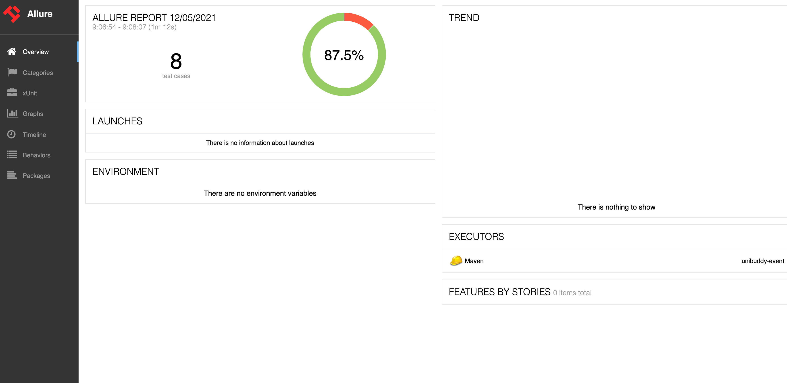
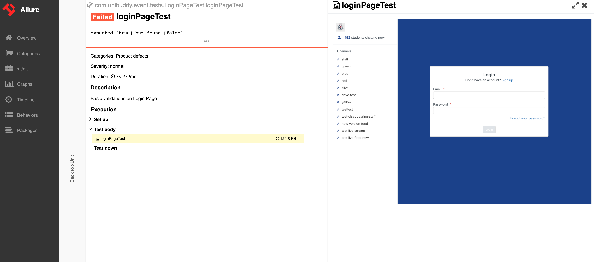

## Execute Test:
`mvn clean test`

## Test Configurations
By default **TestNg.xml** will be picked for test execution configurations. If a new configuration file exists then use
`mvn clean test -DsuiteXmlFile=<newConfigurationFile.xml>`

Also use other options like
* -Dbrowser=firefox
* -Dheadless=true

## Report generation after Test execution
`mvn allure:report`

### Reports
Allure reports can be viewed by opening _**target/site/index.html**_ file

Screenshots attached for failed Test cases

